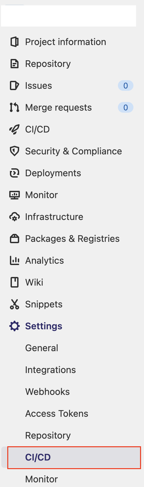

# **자.... Next.js 배포를 시작하지... 🔫**


> 프론트엔드 개발자도 인프라쪽 지식이 있어야 된다고 생각해요.<br>본인이 만든 프로젝트를 서버에 배포까지 할 수 있어야 웹 개발자의 역할 아닐까요? - _개발자 K군 in 개발팀_

<br>

# **1. 회사 상황** 🏡

## 1-1. 나의 상황

현재 프론트엔드 개발자가 나 혼자인 상황이었다. 내가 입사하기 전까지 백엔드 개발자께서 회사 인프라를 처음부터 구축하셨고 당연히 배포까지 혼자 담당하고 계셨다. 프론트엔드 개발자가 들어왔으니, 프론트 프로젝트 파일 배포들은 맡아서 하는게 본인 실력 향상에도 좋다고 하셨고 나 역시 그렇게 생각했다.

## 1-2. 회사 인프라 상황

회사내의 인프라 시스템에 대해서는 자세히 쓸 수 는 없을 것같다. 크게 보았을때 우리 회사는 AWS의 Light Sail을 쓰고 있다. 현재 개발팀 인력, 관리, 비용, 프로젝트 규모를 고려했을때 EC2보다 더 나은 선택지라고 판단하셨다고 했다. _EC2와 LightSail의 차이는 따로 글을 올려보겠다._<br>
결론적으로 현재 회사 서비스들은 AWS LightSail 서비스의 Linux기반 Ubuntu Server(20.04LTS)에서 돌아가고 있다.<br>
추가로 대부분의 프로젝트들은 Gitlab기반 CI-CD로 배포를 진행하고 있다.(프론트 프로젝트들은 테스트코드를 통한 테스트를 따로 하지 않고 배포하고 있다...)

## **1-3. 닥친 상황 🤯**

기존에는 html,css,js프로젝트, React프로젝트 프로젝트들만 진행을 했었다가 얼마전 Next.js 기반 서비스를 하나 진행했고 배포해야 하는 상황이 왔다. React나 html,js들로 만든 프로젝트들은 소위말하는 `정적파일`들이고 이는 (웹 서버에 따로 라우팅 설정을 해줘야 겠지만) 보통 정적 파일들만 웹 서버에 올리면 배포가 완료 된것이고 유저가 해당 url로 접속하면 해당 파일들을 보여주는 구조이다.<br>
하지만 Next.js는 기존방식으로는 배포 할 수 없다. 애초에 `정적파일`이 아닌 서버이기 때문이다.

<br>

# **2. Next.js 배포과정 + CI-CD** 📂

## 2-1 React 프로젝트와 차이점

Next.js 배포 이전에 React와 Next.js가 유저가 사이트에 접속하고 어떻게 프로젝트가 보여지는지 인프라 관점(회사 인프라 기준)에서 간단하게 설명하려고한다.

### **1. React 프로젝트**

유저가 특정 주소로 접속을 하면(80포트로 접속) 웹 서버(Nginx)에서 config파일에 명시되어있는 파일위치에서 특정 프로젝트를 불러와 해당 파일을 브라우저에 응답으로 전송해주면 유저가 그 서비스를 볼 수 있다.

### **2. Next.js 프로젝트 ✨**

유저가 특정 주소로 접속을 하면(80포트로 접속) 웹 서버(Nginx)에서 _WAS의 메모리 상에 올라가 실행되고있는 Next.js서버로 보내준다._ 이 방법을 적용하기 위해서 Nginx의 site-availble 파일에 proxy_pass를 설정하여 Next.js서버가 돌아가고 있는 해당 주소로 보내준다.

```shell
  location @next-proxy {
            proxy_pass http://127.0.0.1:3000;
        }

  location /project {
          try_files $uri @next-proxy;
        }
```

URL이 project로 시작하는 주소로 접근하면 `http://127.0.0.1:3000`으로 보내준 다는 뜻이다.

<br>

## **2-2 Gitlab CI-CI를 활용한 Next.js 배포**

### 1. 사전작업 (gitlab-runner 설치 및 등록)

회사는 실제 서비스가 운영되어 돌아가고 있는 운영서버와 운영서버에 올리기전 개발자들이 테스트를 해볼수 있는 개발서버로 나뉘어져있다. <br>
**CI-CD를 활용한 배포를 구축하기 위해서 운영서버와 개발서버에 각각 Gitlab-runner를 설치하고 연결해주어야 한다.**<br>
개발자가 코드를 main에 Push하게 되면 운영서버로 빌드 후 배포가 되고, dev로 Push를 하게 되면 개발서버로 빌드 후 배포가 되도록 만들어 놓았다.

1. Ubuntu Server로 접속한다.
2. Gitlab-runner 설치

```shell
curl -LJO https://gitlab-runner-downloads.s3.amazonaws.com/latest/deb/gitlab-runner_amd64.deb

sudo dpkg -i gitlab-runner_amd64.deb
```

3. Gitlab-runner 등록

   

4. Gitlab-runner 등록되었는지 확인
   
   각각 운영서버는 prod라는 tag를 개발서버는 dev라는 tag를 붙여서 구분을 한다.

<br>

### 2. `.gitlab-ci.yml` 파일 작성

push를 하게 되면 이 Gitlab-runner가 트리거되어 해당 프로젝트 안에 있는 `.gitlab-ci.yml`파일 안에 있는 코드들을 순차적으로 실행하여 CI-CD작업을 실행한다.


**[빌드 CD 스크립트 주요내용](http://property-dev.dgdr.io:9999/dgdr-dev/dgdr-community-web/-/blob/main/.gitlab-ci.yml)**

1. `npm i`으로 해당 프로젝트 package들을 설치한다.
2. `npm run build`로 next프로젝트의 build파일을 생성한다.(개발서버와 운영서버가 각각 다른 API서버를 보고 있기 때문에 그 작업을 따로 해주어야한다.) 나는 개발서버는 `npm run build:dev`라는 커스텀 명령어를 쓴다.
3. 해당 디렉토리에 기존에 올라가 있던 소스코드를 삭제한다.
4. 현재 빌드된 폴더 .next하위 파일들을 복사하여 해당 디렉토리로 붙여넣는다.
5. build Success

**[배포 CI 스크립트 주요내용](http://property-dev.dgdr.io:9999/dgdr-dev/dgdr-community-web/-/blob/main/next_community_deploy.sh)**

1. gitlab-runner가 해당프로젝트 안에 있는 `next_community_deploy.sh`파일을 실행 시킨다. (2번부터 .sh파일 실행 명령)
2. Next.js 서버에 `curl -L $BASE_URL:$SERVICE_PORT$HEALTH_CHECK_API` 명령으로 Health Check를 보낸다. (목적 : 이전 서버가 실행되고 있는지 확인)
3. 만약 health check요청 응답으로 `'{"status":"ok"}'`를 받으면 기존에 올라가 있던 Next.js서버를 닫는다.
4. Next.js 신규 빌드된 파일들이 위치한 디렉토리로 들어가서 nohup 으로 Next.js 프로젝트를 실행시킨다.
5. 10초후에 다시한번 health Check요청을 날린다.
6. 만약 health check요청 응답으로 `'{"status":"ok"}'`를 받으면 슬랙봇 메시지로 배포 완료 메시지를 날린다.

<br>

## **3 Gitlab CI-CD 동작원리 간단하게 🔨**

1. 개발자가 gitlab remote서버에 소스 코드를 푸쉬한다.
2. 해당 레포지토리에서 타켓서버에 있는 Gitlab-runner를 트리거한다.
3. 타겟서버에 있는 Gitlab-runner가 remote서버에 있는 소스코드를 git pull 하여 최신 소스크드를 받아온다.
4. 최신 소스코드(프로젝트)안의 `.gitlab-ci.yml` 파일을 실행시킨다.
5. CI 스크립트 실행 (위 참고)
6. CD 스크립트 실행 (위 참고)


<br>

## **4 개선해야 할 사항**

현재 CI-CD 파이프라인은 최소한의 빌드, 배포만 적용되어 있다. 향후 추가해야할 사항이 몇가지 있다.

### **4-1 배포 스크립트 개선 🛠️**

현재 배포 스크립트는 기존 Next.js 서버를 내리고 최신 코드가 반영된 Next.js 서버를 실행시킨다. 그렇다면 기존 Next.js서버를 내리는 시점과 신규 Next.js서버를 실행 시키는 시점 사이에 짧은 시간이 존재하는데 이 시간동안에는 서비스가 죽어있다는 뜻이다.<br>
이 점을 개선하기 위해 `포트 체인지`방식으로 서비스가 내려가 있는 시간을 아예 없애는 방향으로 배포 스크립트를 개선 해야 할 것 같다.<br> 예를들어 기존에 Next.js가 3001번 포트에서 실행 되고 있는 상태라면, 3002번 포트에 새로운 코드가 반영된 Next.js 서버를 실행시키고, 3002번 포트에서 정상적으로 실행되고 있다면, 3002번 포트로 Nginx에서 proxy_pass를 변경한다. 그리고 기존 3001번 포트에서 돌아가고 있던 Next.js 서버를 종료한다. <br> 배포 할때마다 3001 <-> 3002 포트를 변경하면서 무중단 배포처럼 보이게 할 수 있다.
추가로 만약 신규로 올린 Next.js 서버에 health check를 했는데 응답에 실패한다면 이전에 올렸던 서버로 롤백하는 코드도 추가해야 할 것같다.

### **4-2 테스트 코드 작성 🛠️**

빌드 후 테스트 과정을 거쳐 테스트를 통과하면 배포를 진행한다. 테스트 과정이 추가되야 사실 안전한 CI-CD라고 볼 수 있기때문에, 테스트 코드 작성 방법과 이를 어떻게 CI-CD 스크립트에 적용해야 할지는 앞으로의 숙제이다.

<br>

## **5. 느낀점 😇**

요즘에 Next.js 서버를 배포 하는 방식을 검색하면 EC2를 활용하거나, Vercel, Netify등 클라우드 서버를 이용해서 배포하는 방식들이 많이 나온다. 회사에서 배포하는 방식이 요즘 많이 사용하는 방식과 조금 다르지만, 이번 기회를 통해 우리 회사 서비스의 인프라구조와 웹서버, WAS, AWS, 프록시, 포트 등등 일반 적인 서버 지식에 대하여 큰 흐름을 배울 수 있었다.<br>
프론트엔드 개발자 역시 인프라쪽도 알고 있어야 된다고 생각을 했었고, 자신이 만든 프로젝트는 배포, 혹은 CI-CD 까지 할 줄 알아야 한다. 아직은 큰 흐름에서만 익혔고 좀 더 딥한 지식이나 설정같은 것은 공부를 더 해야겠지만, 현재 개인적으로 프로젝트를 만든다면 Ubuntu 서버를 열어서 Nginx설정을 하고 배포까지 하는건 할 수 있을 것같다.<br>
사실 여기오기까지 서버 개발자분이 많이 도와 주셨고, 질문을 많이하고 검색한게 큰 도움이 되었다.<br>
앞으로도 지금 보다 더 개선된 배포 프로세스를 적용하고 익히기 위해 노오력 해야 겠다!

<br>

## **6. Reference 📑**

[Nginx Reverse Proxy 설정하기](https://phsun102.tistory.com/47)
